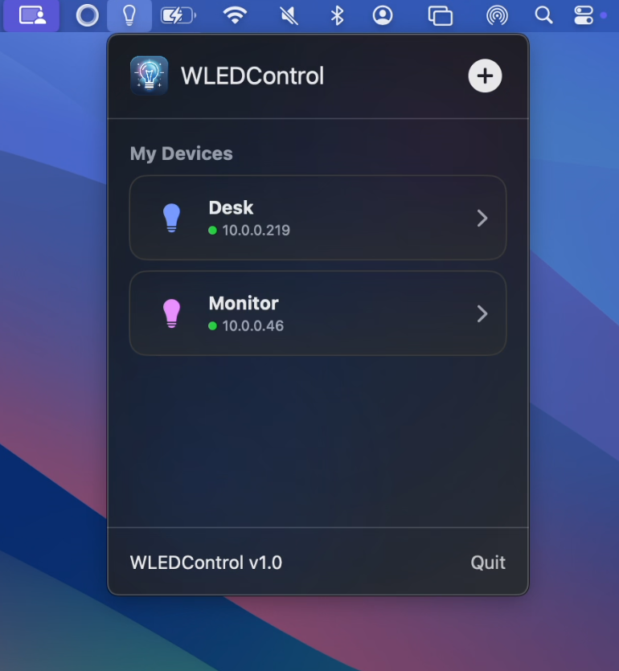
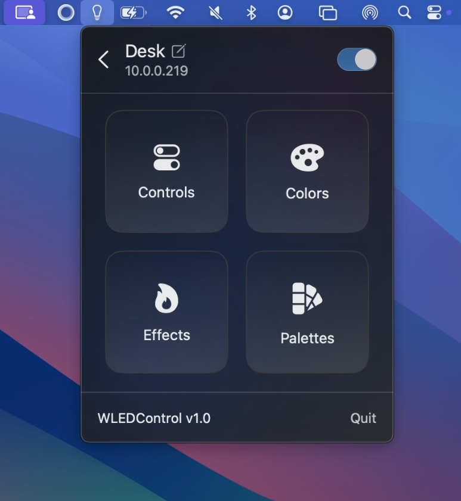
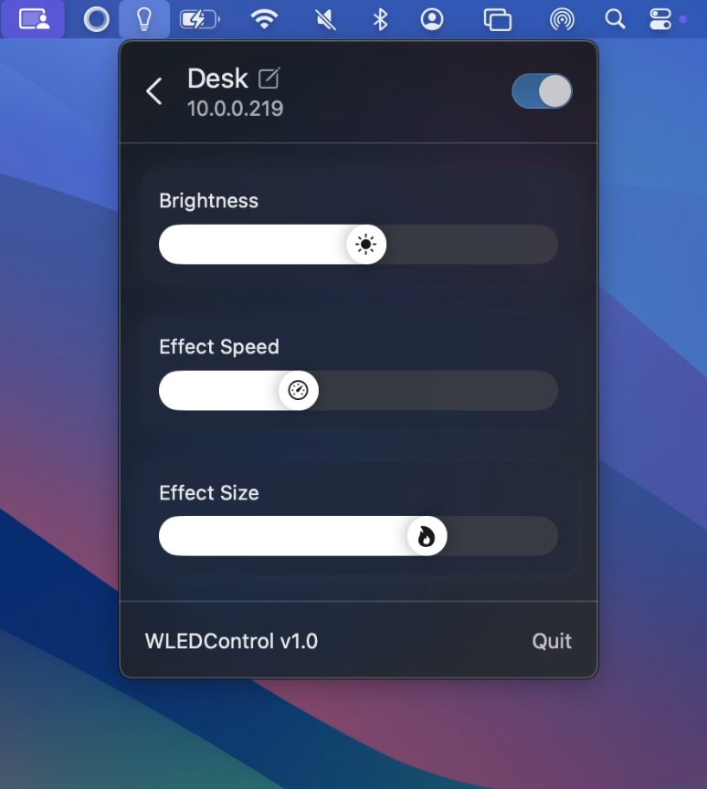
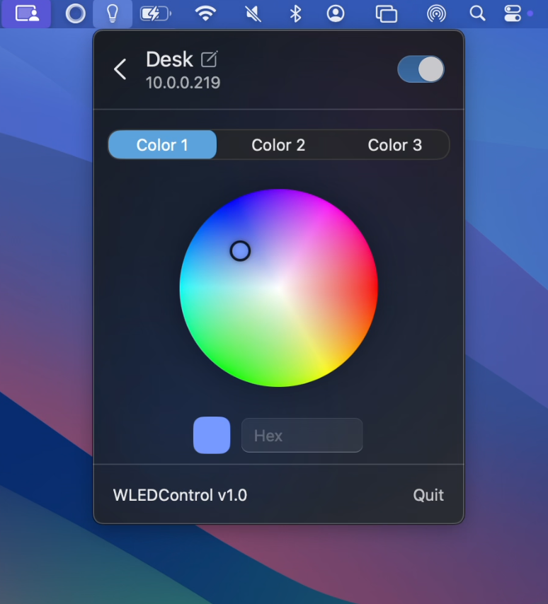

# WLEDControl

<p align="center"><a href="https://apps.apple.com/us/app/wledcontrol/id6759883611"></a></p>

[](https://swift.org)
[](https://github.com/arjun-dureja/WLEDControl/stargazers)
[](./LICENSE)
[](https://developer.apple.com/macos/)

WLEDControl is a macOS menu bar app for controlling [WLED](https://kno.wled.ge/) devices on your local network.

It focuses on fast everyday actions: toggle power, set brightness, pick colors, and apply effects/palettes.

## Features
- Quick access from the macOS menu bar
- Discover WLED devices on your local network or add devices manually
- Power on/off and adjust brightness
- Live presence monitoring (online/offline/connecting)
- Device rename and local persistence
- Controls for power, brightness, effect speed/size
- Color wheel + hex input
- Effects and palette browsing

## Screenshots

 
 

## Project Structure

```text
WLEDControl/
  Model/
  Service/
  Store/
  View/
  ViewModel/
  Theme/
  Extensions/
```

## Requirements

- macOS 14.0+
- Xcode 17+

## Build and Run

Open in Xcode and run the `WLEDControl` scheme, or build from terminal:

```bash
xcodebuild -project WLEDControl.xcodeproj -scheme WLEDControl -configuration Debug build
```

## Dependencies

- [Starscream](https://github.com/daltoniam/Starscream)
- [FluidMenuBarExtra](https://github.com/lfroms/fluid-menu-bar-extra)
- [ModernSlider](https://github.com/arjun-dureja/ModernSlider)

## Contributing

Contributions are welcome! Open an issue or submit a pull request.
